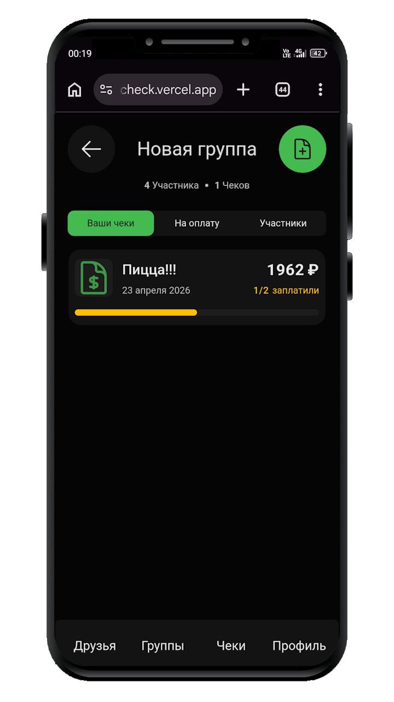
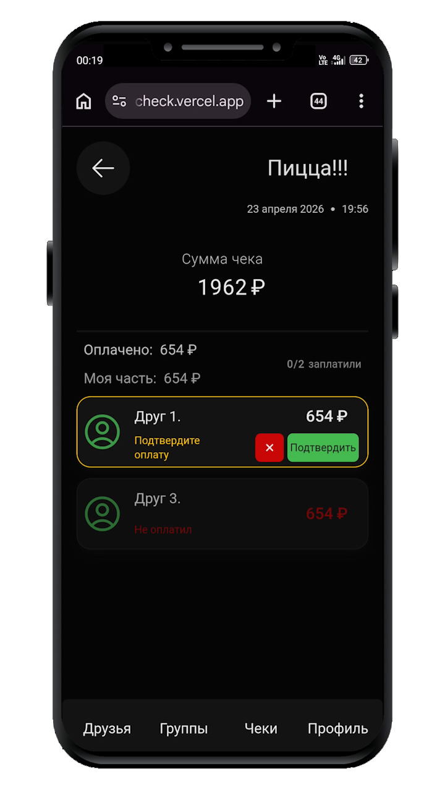
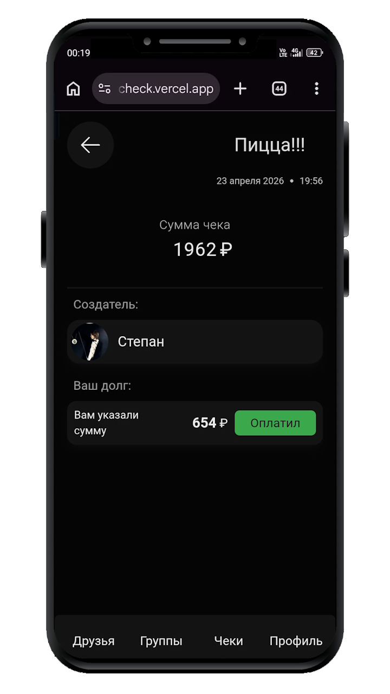
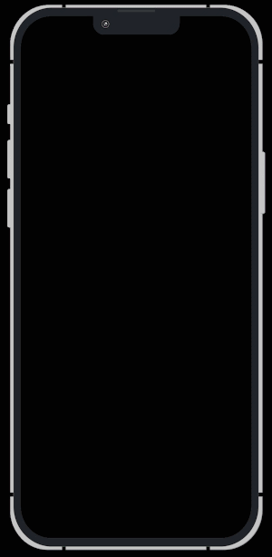
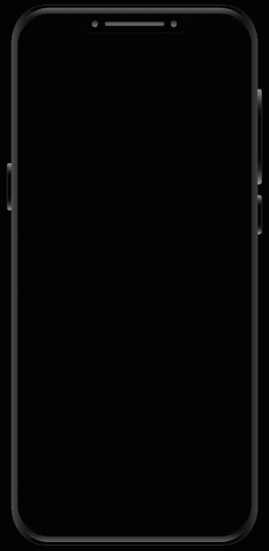
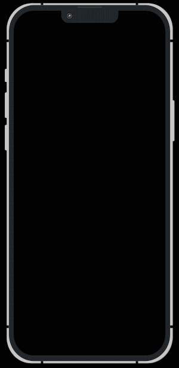
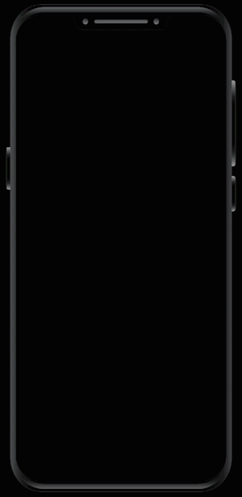
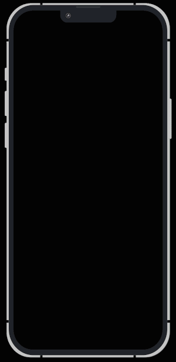
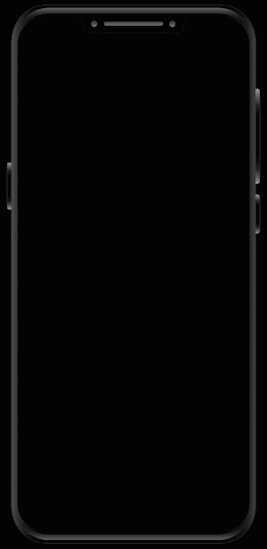

# ПослеЧек

Сервис для учета общих расходов, который избавляет от необходимости помнить, кто и сколько должен.
Вы спокойно распределяете суммы между друзьями уже **после** того, как оплачен общий чек, и приложение сохраняет эти записи в виде понятной истории долгов.
> Не взаимодействует с банками и переводами - просто записи

[posle-check.vercel.app](https://posle-check.vercel.app)

---
## Интерфейс приложения

  
  
  

---
## Основные возможности

* **Друзья и группы:** Можно добавлять пользователей в друзья и объединять их в группы для разных событий или поездок.
* **Распределение чека:** 
  * Деление общей суммы поровну на всех участников.
  * Ручное распределение разных сумм на каждого человека.
  * Возможность отдельно распределить доставку/чаевые, если они есть.
  * Можно оставить сумму на усмотрение участника(Он сам знает, сколько должен)
* **Авторизация:** Вход через Google или Яндекс (реализовано с помощью NextAuth).
* **Mobile First:** Удобное использование на мобильных устройствах.

---

## Демонстрация работы

Так как приложение требует авторизации и наличия связей между пользователями, ниже представлены основные этапы работы с интерфейсом:
* **Добавление друзей**
  * 

      
<b>Найдите друга по Email</b>

       
      
    

  * 

      
<b>Дождитесь подтверждения от друга</b>

       
      
    

* **Создание группы**
  * 

      
<b>Начните создание и введите название</b>

       
      
    

  * 

      
<b>Добавьте друзей</b>

       
      
    

  * 

      
<b>Дождитесь принятия приглашения</b>

       
      
    

* **Создание чека**
  * 

      
<b>Начните создание, введите название и полную сумму</b>

       
      
    

  * 

      
<b>Выберите участников чека (если не все)</b>

       
      
    

  * 

      
<b>Распределите суммы (Например, поровну)</b>

       
      
    

  * 

      
<b>Проверьте данные</b>

       
      
    

* **Взаимодействие с чеком**
  * 

      
<b>Ваш друг информирует об оплате</b>

       
      
    

  * 

      
<b>Вы подтверждаете его оплату</b>

       
      
    

---

## Технический стек

Проект построен на актуальном стеке с акцентом на серверный рендеринг:

* **Framework:** Next.js (App Router)
* **Язык:** TypeScript
* **Стили:** Tailwind CSS
* **Анимации:** Motion (Framer Motion)
* **Авторизация:** NextAuth.js (OAuth: Google, Yandex)
* **База данных:** Neon (PostgreSQL)
* **Работа с БД:** Postgres.js

---

## Особенности реализации

* **Логика расчетов:** Математический расчет долей реализован на стороне клиента с последующей валидацией на сервере перед записью в базу данных.
* **Server Actions:** Взаимодействие с базой данных и обновление интерфейса реализовано через серверные действия Next.js.
* **SQL:** Запросы к базе написаны на чистом SQL через postgres.js для лучшего контроля.

## Контакты

По всем вопросам, предложениям и багрепортам:

- **Telegram:** [@sharikov_stepan](https://t.me/sharikov_stepan)
- **Email:** Stepkoy@live.com

---